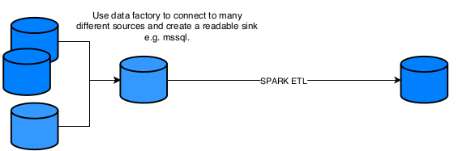
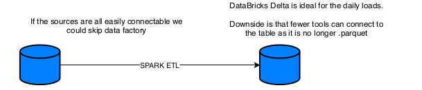
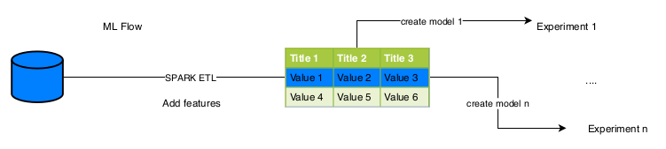
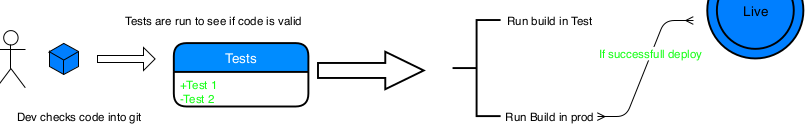
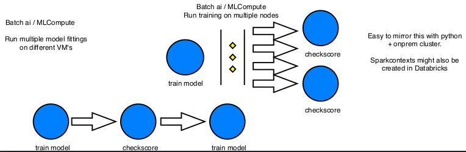

## Modules

We were presented for a wide range of services and products from Microsoft and Databricks. The most notable ones were.

- Batch AI (soon to be known as MLCompute)
- Azure DevOps
- Azure ML Studio
- Azure ML Workbench
- Azure ML SDK
  - Automl
- Azure ML Service - MLFLOW
- Azure Datafactory
- Databricks Delta
- Microsoft Bot SDK
  - LUIS
  - Cognitive Services

We can also look at which function each service serves, and come with alternative usages.

| Function                          	| Service                                       	| Description                                                                                                                                                                                                                                   	| Alternative                                       	|
|-----------------------------------	|-----------------------------------------------	|-----------------------------------------------------------------------------------------------------------------------------------------------------------------------------------------------------------------------------------------------	|---------------------------------------------------	|
| Paralelizaiton (Not distributing) 	| Batch AI / MLCompute                          	| Used to spin up multiple VM's to speed up computation                                                                                                                                                                                         	| Python script starting multiple spark contexts    	|
| Workflow Structuring              	| Azure Devops                                  	| Contains many modules:- Git - Hooks for tests - Deployment - Connect to or act as scheduling agent - Has build in Trello-board                                                                                                                	| Git + hooks + docker + Trello + AirFlow / Jenkins 	|
| IDE                               	| Azure ML Studio                               	| Azure Machine Learning Studio is an older product,  and provides a drag and drop interface for creating  simply machine learning processes.  It has limitations about the size of the data  that can be handled (about 10gigs of processing). 	| SAS Enterprise miner  Any python or R IDE         	|
|                  IDE                 	| Azure ML Workbench                            	| UI for calling different Azure ML CLI's                                                                                                                                                                                                       	| SAS Enterprice miner                              	|
|                   Python library                	| Azure ML SDK - Automl                         	| Package with Algorithms for model training, and hyper parameter tuning.                                                                                                                   | Sci-kit learn + hyperopt                                                     	|
|                 Model Score board                  	| Azure ML Service - MLFLOW                     	| UI for keeping track of performance for several model runs.                                                                                                                                                                                                                                       |  MLFLow is open source                                                    	|
|                    Data integraion               	| Azure Datafactory                             	| Has connectivity with a wide range of data sources                                                                                                                                                                                                                                               	| alternatives could be Kafka or simply spark with database drivers.                                                   	|
|               Append ETL tool for SPARK                    	| Databricks Delta                              	| Uses parquet with a layer of transaction logs to make it possible to go back to previous builds and to have ease of insertion. Also it uses file level statistics for faster query times. Finally it also uses compaction so small files wont slow performance over time.                                                                                                                                                                                                                                    	|   Custom spark scripts using the JVM file handler (Tetris)                                                 	|
|    Bot framework                                	| Microsoft Bot SDK    - LUIS - Cognitive Services 	|                 Create bots to react to user input, can be created with a range of different cognitive services attached. E.g. a Bot that can tell which object is in photos and give a probability of intent from the user, when a message is recieved. So "Send photos of dogs" is mapped to intent: .77 request for dog photos.                                                                                                                                                                                                                              	|  Custom python scripts                                                   	|

-----

# Concepts

#### Data factory

----

#### MLFLow

----

#### Azure DevOps

----

#### Batch AI / MLCompute

